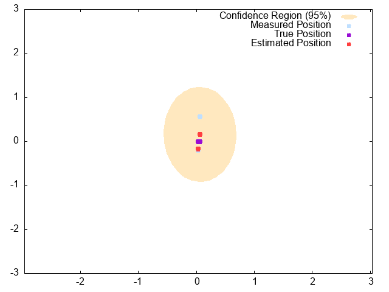
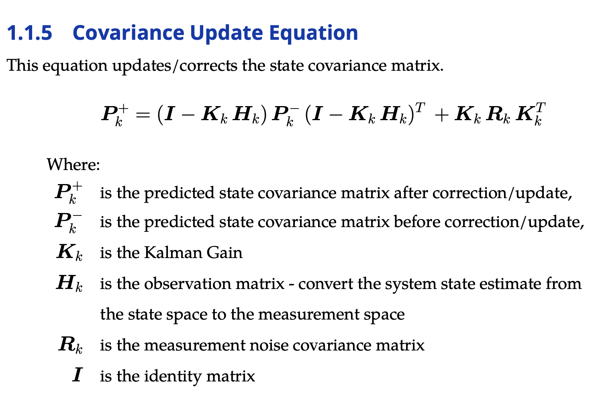

# kalman_variants - a selective set of Nonlinear Kalman Filter Variants

<table>
  <tr>
    <td>
      
    </td>
    <td>
      
    </td>
  </tr>
</table>

**Maintainer Status: Actively maintained**
## Package Summary
`kalman_variants` implements several Kalman filter nonlinear variants with state estimation applications for robot and autonomous systems in mind. The package includes detailed line-by-line annotated code for every implementation of the kalman filter variant. You will also have free access to an implementation guide at [Kalman_filter_variants/doc/Kalman_Implementation_Guide_For_Dummies.pdf](https://github.com/jiangjingxue/Kalman_filter_variants/blob/18eac9ea2c95a9e930855d244a0914131d351721/doc/Kalman_Implementation_Guide_For_Dummies.pdf) to go along with the code to accelerate your learning. 
<br/> <br/>
At the moment, this package implements 
* Extended Kalman Filter (EKF) w/ landmark-localization tutorial
* Error State Extended Kalman Filter (ESEKF) 
* Unscented Kalman Filter (UKF)

Moreover, it implements the following vehicle motion model in both discrete and continuous formulations
* Kinematic Bicycle Model  
* Kinematic Differential Drive Model 
* Kinematic Ackermann Model
* Dynamic Bicycle Model

## Installation
Download the source via git clone 
````
cd <your directory>
git clone https://github.com/jiangjingxue/kalman_filter_variants.git
python setup.py install
````
## Basic Use
First, import the filters and helper functions.
````python
import numpy as np
from kalman_variants.ekf import EKFLocalization
from kalman_variants.common import AddictdeNoise
````
Create the filter 
````python
my_ekf = EKFLocalization()
````


